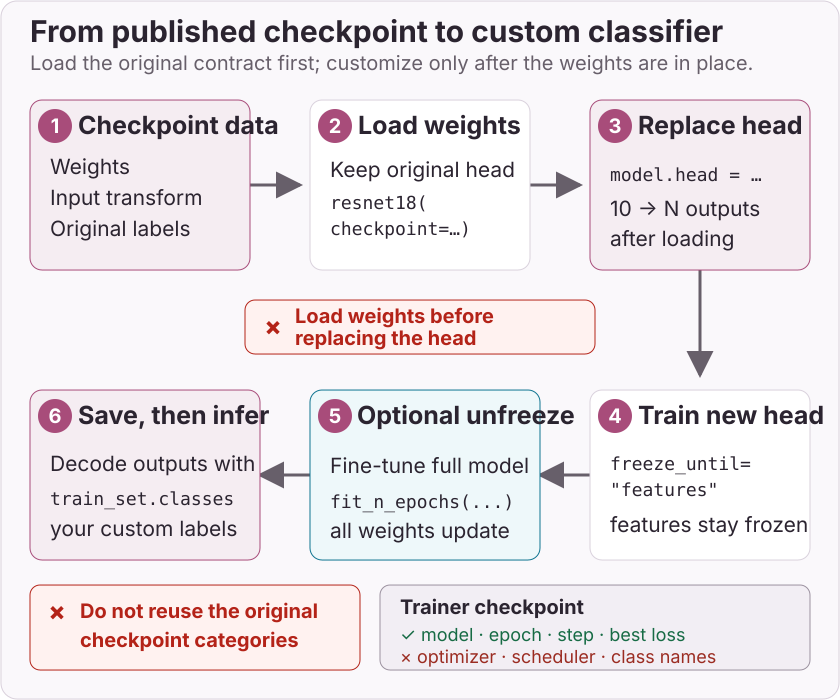

# Fine-tune a classifier

This guide adapts the default pretrained ResNet-18 to a folder of custom
classes. `ResNet18_Checkpoint.DEFAULT.value` was trained on
[Imagenette](https://github.com/fastai/imagenette), a ten-class subset of
ImageNet. Many bundled classification checkpoints target Imagenette; selected
ReXNet checkpoints target ImageNet-1K instead. Always inspect the selected
checkpoint metadata.



## Prepare the dataset

[`ImageFolder`][torchvision.datasets.ImageFolder] expects one directory per
class, with matching class directories under `train` and `val`:

```text
dataset/
├── train/
│   ├── class_a/
│   │   ├── image_001.jpg
│   │   └── image_002.jpg
│   └── class_b/
│       └── image_003.jpg
└── val/
    ├── class_a/
    │   └── image_004.jpg
    └── class_b/
        └── image_005.jpg
```

Load the checkpoint metadata first. It defines the input size, interpolation,
normalization and original labels used by the published weights:

```python
import torch
from torch import nn
from torch.utils.data import DataLoader
from torchvision.datasets import ImageFolder
from torchvision.transforms.v2 import (
    Compose,
    ConvertImageDtype,
    Normalize,
    PILToTensor,
    RandomHorizontalFlip,
    RandomResizedCrop,
    Resize,
)

from holocron.models.classification import ResNet18_Checkpoint, resnet18
from holocron.trainer import ClassificationTrainer

checkpoint = ResNet18_Checkpoint.DEFAULT.value
preprocessing = checkpoint.pre_processing
original_labels = checkpoint.meta.categories

train_transform = Compose([
    RandomResizedCrop(
        preprocessing.input_shape[1:],
        interpolation=preprocessing.interpolation,
    ),
    RandomHorizontalFlip(),
    PILToTensor(),
    ConvertImageDtype(torch.float32),
    Normalize(preprocessing.mean, preprocessing.std),
])
val_transform = Compose([
    Resize(
        preprocessing.input_shape[1:],
        interpolation=preprocessing.interpolation,
    ),
    PILToTensor(),
    ConvertImageDtype(torch.float32),
    Normalize(preprocessing.mean, preprocessing.std),
])

train_set = ImageFolder("dataset/train", transform=train_transform)
val_set = ImageFolder("dataset/val", transform=val_transform)
if train_set.classes != val_set.classes:
    raise ValueError("train and val must contain the same class directories")

train_loader = DataLoader(train_set, batch_size=32, shuffle=True, num_workers=4)
val_loader = DataLoader(val_set, batch_size=32, num_workers=4)
```

`original_labels` describes the checkpoint's Imagenette outputs before the
head is replaced. `train_set.classes` describes your custom outputs.

## Load the weights, then replace the head

The checkpoint must load while the model still has its original ten-output
head. Replace `model.head` only afterwards:

```python
model = resnet18(checkpoint=checkpoint)
model.head = nn.Linear(model.head.in_features, len(train_set.classes))
```

Replacing the head before loading the checkpoint would create a state-dict
shape mismatch.

## Train the custom head

Start by freezing `features`, which leaves the new head trainable:

```python
criterion = nn.CrossEntropyLoss()
optimizer = torch.optim.AdamW(model.parameters(), lr=3e-4)
trainer = ClassificationTrainer(
    model,
    train_loader,
    val_loader,
    criterion,
    optimizer,
    gpu=0 if torch.cuda.is_available() else None,
    output_file="resnet18-custom.pth",
)
trainer.fit_n_epochs(5, lr=3e-4, freeze_until="features")
```

Optionally unfreeze the full model and continue at a lower learning rate:

```python
trainer.fit_n_epochs(5, lr=1e-4)
```

Calling `fit_n_epochs` without `freeze_until` makes every model parameter
trainable again.

## Save and resume

The trainer automatically saves its best validation state to `output_file`.
You can also save and load explicitly:

```python
trainer.save("resnet18-custom.pth")
state = torch.load("resnet18-custom.pth", map_location="cpu", weights_only=True)
trainer.load(state)
```

Current trainer checkpoints contain the model, epoch, step and best loss. They
do **not** contain optimizer or scheduler state, so loading resumes model and
counter state rather than the exact optimization trajectory. Persist
`train_set.classes` with your deployment artifacts because trainer checkpoints
do not store class names.

## Run inference with custom labels

After fine-tuning, use `ImageFolder.classes`, not
`checkpoint.meta.categories`, to decode the new head:

```python
from PIL import Image

image = Image.open("image.jpg").convert("RGB")
device = next(model.parameters()).device

model.eval()
with torch.inference_mode():
    probabilities = model(val_transform(image).unsqueeze(0).to(device)).squeeze(0).softmax(dim=0)

class_idx = probabilities.argmax().item()
label = train_set.classes[class_idx]
confidence = probabilities[class_idx].item()
print(label, confidence)
```

## Target constraints

For the `CrossEntropyLoss` setup above, hard targets are `torch.int64` class
indices in `[0, number_of_classes)`. A configured `ignore_index` may appear
outside that range and excludes those hard targets from the loss. Soft targets
are also supported as floating-point class probabilities with the same shape
as the logits; `ignore_index` applies only to hard class-index targets.
