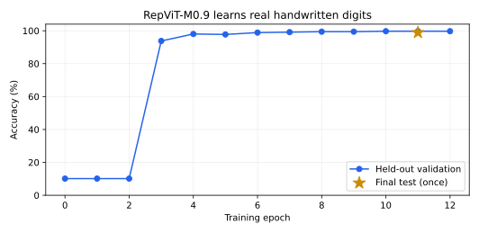

# RepViT

RepViT is based on the
["RepViT: Revisiting Mobile CNN From ViT Perspective"](https://arxiv.org/abs/2307.09283)
paper and its [official implementation](https://github.com/THU-MIG/RepViT).

## Architecture overview

RepViT adapts mobile CNN blocks using design choices associated with efficient
vision transformers. Each block separates spatial token mixing from channel
mixing, uses squeeze-excitation selectively, and can fuse its training-time
depthwise branches for deployment.

Think of the training block as three paths that look at the same image. Fusion
adds their fixed weights into one path. The output stays the same within normal
floating-point error, and the device has fewer operations to run.

```text
Train or fine-tune             Call eval(), then fuse         Run the model

3 x 3 depthwise convolution ─┐
1 x 1 depthwise convolution ─┼─ add + batch norm ───────────► one 3 x 3 convolution
unchanged input ────────────┘
```

Call `model.eval()` and then `model.reparametrize()` before exporting or
benchmarking the deployment form. Conversion preserves evaluation mode, removes
all batch-normalization layers, and can be called repeatedly. Calling it while
the model or a batch-normalization layer is in training mode raises `ValueError`.

## Paper evidence

These ImageNet-1K results are teacher-distilled scores reported by the authors,
not Holocron benchmark results.

| Model | Parameters | MACs | Top-1, 300 epochs | Top-1, 450 epochs |
|---|---:|---:|---:|---:|
| RepViT-M0.9 | 5.1M | 0.8G | 78.7% | 79.1% |
| RepViT-M1.0 | 6.8M | 1.1G | 80.0% | 80.3% |
| RepViT-M1.1 | 8.2M | 1.3G | 80.7% | 81.2% |

Both columns use distillation and 224 x 224 inputs. More training explains the
different scores. The local checks below do not reproduce these accuracy scores.

## Use the authors' checkpoint

Download the authors' [M0.9 450-epoch checkpoint](https://github.com/THU-MIG/RepViT/releases/download/v1.0/repvit_m0_9_distill_450e.pth).
Its SHA-256 is `b76537a20b8c47ef40c1b884bd88f4f3cae498b90f35c61d32da44c16c221443`.
Load the unfused checkpoint before fusion:

```python
import torch
from holocron.models import repvit_m0_9

state = torch.load("repvit_m0_9_distill_450e.pth", map_location="cpu", weights_only=True)["model"]
model = repvit_m0_9(num_classes=1000)
model.load_official_state_dict(state)
model.eval()
torch.save(model.state_dict(), "repvit-m0.9-imagenet-imported.pth")
```

The import maps the authors' flat block names to Holocron's stages. It checks
keys and shapes before it copies weights. The distilled checkpoint has two
classifier heads. The import combines their evaluation logits into one head,
including each head's batch-normalization weights. This is more than an average
of the raw linear weights.

For a new task, keep a new classifier and import only the backbone:

```python
model = repvit_m0_9(num_classes=10)
model.load_official_state_dict(state, include_head=False)
model.train()
```

This supports ordinary fine-tuning. It does not recreate the authors' two-head
distillation loss. `pretrained=True` still has no default Holocron checkpoint;
use the explicit import above.

The real M0.9 checkpoint was compared with the authors' unchanged model code at
commit `298f42075eda5d2e6102559fad260c970769d34e`, using timm 0.6.13. On two seeded
224 x 224 random inputs, the maximum logit error was `3.70e-6` before fusion and
`8.52e-6` after fusion. Both passed `rtol=1e-4`, `atol=1e-5` in FP32. This checks
weight and output equivalence; it does not measure ImageNet accuracy. The record
is in [repvit-official-import.json](https://github.com/frgfm/Holocron/blob/main/references/classification/results/repvit-official-import.json).

## Short training run on real digits

Run this command from the repository root:

```shell
python references/classification/train_repvit_digits.py --epochs 12 --threads 2
```

The script downloads the 1,797 handwritten digits packaged with scikit-learn.
The source is pinned to version 1.7.2 and checked with SHA-256. It needs no
scikit-learn install. It changes the 8 x 8 gray images to 32 x 32 RGB inputs,
then trains all 4,722,410 parameters of M0.9 from random weights.

| Item | Setting |
|---|---|
| Split | 1,074 training / 355 validation / 368 test images |
| Split seed | 42; each class is split separately; no shared examples |
| Training | 12 fixed epochs; batch 64; FP32; AdamW; initial learning rate `1e-3` |
| Schedule | Cosine decay to `1e-4`; no data augmentation |
| Select weights | Lowest validation loss; epoch 11 in this run |
| Test | Evaluate once, after weight selection |



| Measurement | Result |
|---|---:|
| Initial validation accuracy | 10.14% |
| Selected validation accuracy | 99.72% (354 / 355) |
| Final test accuracy | 98.91% (364 / 368) |
| Final test loss | 0.05134 |
| Training time | 77.16 seconds |

This run used an Intel Xeon Platinum 8370C, two CPU threads, Python 3.11.16, and PyTorch
2.13.0. Backbone weights changed during training. The saved
[run record](https://github.com/frgfm/Holocron/blob/main/references/classification/results/repvit-digits.json)
contains each epoch, split hashes, class counts, settings, and the checkpoint
hash. The script saves the best weights in `checkpoints/repvit-digits.pth`.

This is a check that the full model learns and generalizes to separate examples.
The small digit set is easier than ImageNet. The split is by image, not by
writer. Its accuracy is not an ImageNet or Imagenette result.

## Check fusion speed

Use the imported 1,000-class checkpoint from the example above:

```shell
python references/classification/benchmark_repvit.py \
  --checkpoint repvit-m0.9-imagenet-imported.pth \
  --num-classes 1000 --sizes 224 --threads 2
```

The script uses the same weights and input for both model forms. It checks
output agreement, warms up each form 20 times, then measures 100 CPU forwards
per form. It alternates the order of each pair to reduce drift from the shared host.
It reports median and 95th-percentile latency. These times exclude image loading,
preprocessing, and data transfer. They are local microbenchmarks on a shared
host, not the paper's iPhone timings. See the saved
[measurement record](https://github.com/frgfm/Holocron/blob/main/references/classification/results/repvit-deployment.json).

| Form | Parameters | Median latency | 95th-percentile latency |
|---|---:|---:|---:|
| Before fusion | 5,103,560 | 40.75 ms | 51.65 ms |
| After fusion | 5,067,056 | 29.89 ms | 38.71 ms |

These measurements use the imported ImageNet checkpoint, a 1 x 3 x 224 x 224
input, FP32, and two Intel Xeon Platinum 8370C CPU threads. The maximum logit
difference for that input was `9.54e-6`. Fusion removed all batch-normalization
layers. Local timing can change with host load.

To check the digit-trained model at its own input size, run
`python references/classification/benchmark_repvit.py --sizes 32`.

## Controlled Holocron benchmark

The Holocron comparison trains from scratch on Imagenette without a teacher:
176px training crops, 232px resize and 224px validation crops, 20 epochs,
effective batch size 32, AMP, AdamP at `1e-3`, OneCycle, Mixup `0.2`, and label
smoothing `0.1`. MobileOne-S2 uses the identical command as the baseline.

The controlled comparison can run on CPU, CUDA, or Apple Silicon MPS using
[`benchmark_repvit_imagenette.py`](https://github.com/frgfm/holocron/blob/main/references/classification/benchmark_repvit_imagenette.py).
Use the same backend, precision, and physical batch size for all four models.
The default campaign trains all variants for 20 epochs:

```shell
uv run --no-sync python -m references.classification.benchmark_repvit_imagenette \
  /path/to/imagenette2-320 /path/to/fresh-results --device mps
```

The campaign records selected and final validation metrics, parameter counts,
convolution/linear MACs, synchronized fused inference timing, and memory readings.
MPS reports sampled tensor and driver allocations rather than CUDA VRAM. A CUDA
measurement cannot be inferred from a CPU or MPS run.

### Measured Apple Silicon comparison

All four models completed the same 20-epoch scratch recipe on an Apple M3 Pro
with 36 GiB unified memory, macOS 15.7.7, Python 3.12.13, and PyTorch 2.13.0.
The campaign used seed 0, four loading workers, four CPU threads, physical and
effective batch size 32, and FP16 autocasting with gradient scaling. Validation
contains 3,925 images. Checkpoints are selected by minimum validation loss.

| Model | Params before / after fusion | Fused GMACs | Unfused top-1 | Fused top-1 / top-5 | Selected epoch |
|---|---:|---:|---:|---:|---:|
| RepViT-M0.9 | 4,722,410 / 4,685,906 | 0.815 | 76.97% | 76.87% / 96.76% | 19 |
| RepViT-M1.0 | 6,408,390 / 6,365,802 | 1.106 | 80.33% | 80.31% / 97.38% | 19 |
| RepViT-M1.1 | 7,781,018 / 7,736,442 | 1.337 | 81.53% | 81.53% / 97.83% | 20 |
| MobileOne-S2 | 5,854,324 / 5,778,152 | 1.277 | 80.18% | 80.08% / 97.61% | 20 |

The accuracy table includes a complete validation pass before and after fusion.
FP16 fusion changes a few borderline class decisions; the measurements are not
assumed identical. Fused inference uses batch 1, 20 warmups, and 100 synchronized
timing samples. Preprocessing and data transfer are excluded from inference timing.

| Model | Wall min | Median / p95 ms | Images/s | Sampled tensor / driver GiB |
|---|---:|---:|---:|---:|
| RepViT-M0.9 | 30.3 | 4.75 / 5.56 | 237.2 | 1.42 / 2.50 |
| RepViT-M1.0 | 37.0 | 4.42 / 4.88 | 251.3 | 1.66 / 2.78 |
| RepViT-M1.1 | 39.0 | 5.85 / 7.56 | 165.9 | 1.81 / 2.94 |
| MobileOne-S2 | 46.3 | 2.56 / 2.99 | 479.3 | 2.29 / 3.32 |

Wall time includes data/model setup, training, and validation. Convolution/linear
MACs use a 224px image and exclude normalization and activations. MPS memory was
sampled every 50 ms; it is not an exact peak or CUDA VRAM. The models ran serially
in one process, and driver allocation includes allocator/graph caches. Process
RSS in the raw report is a lifetime peak, not a fresh per-model peak.

Under this single-seed, short recipe, MobileOne-S2 has the lowest MPS inference
latency. RepViT-M1.1 has the highest fused validation top-1, about 1.45 points
higher at roughly 2.3 times the median latency. RepViT-M1.0 trains faster and
uses less sampled training memory than MobileOne-S2, but its small accuracy gain
does not establish a clear inference advantage on this backend. These are
Imagenette/MPS measurements, not ImageNet paper reproduction or CUDA results.

The [raw report](https://github.com/frgfm/holocron/blob/main/references/classification/results/repvit-imagenette-mps.json)
records the recipe, dataset archive hash, selected/final/deployment metrics,
learning curves, checkpoint hashes, counts, timing, memory, and validation limits.
Checkpoints remain local and are not published with this comparison.

These parameter counts use Imagenette's 10 classes. The paper's counts use
an ImageNet-1K classifier with 1,000 classes.

## Model builders

All builders rely on [`RepViT`][holocron.models.RepViT] and accept a custom
class count through `num_classes`.

::: holocron.models.classification
    options:
        heading_level: 3
        show_root_heading: false
        show_root_toc_entry: false
        members:
            - RepViT
            - repvit_m0_9
            - repvit_m1_0
            - repvit_m1_1
