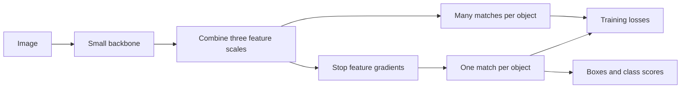

# YOLO26 nano

`yolo26n` adds a small detector to Holocron. It learns boxes and classes in the
same training call. It uses three feature scales to find objects of different
sizes. Its default inference path does not need non-maximum suppression (NMS).

!!! warning "Experimental, without pretrained weights"
    This is an original implementation of the nano architecture. It is not a
    reproduction of the published COCO checkpoint or its full training recipe.
    `pretrained=True` and `pretrained_backbone=True` raise clear errors.



The many-match branch helps train the backbone. The one-match branch learns to
return one prediction for each object. It receives detached features, so its
loss only updates that branch. Both branches use four direct box values; they
do not predict distributions over distance bins. At inference, the model runs
only the selected branch.

## Use

```python
import torch
from holocron.models.detection import yolo26n

model = yolo26n(num_classes=2)
images = torch.rand(2, 3, 96, 128)
targets = [
    {"boxes": torch.tensor([[0.1, 0.2, 0.7, 0.8]]), "labels": torch.tensor([0])},
    {"boxes": torch.empty(0, 4), "labels": torch.empty(0, dtype=torch.long)},
]
losses = model(images, targets)
sum(losses.values()).backward()

model.eval()
with torch.inference_mode():
    predictions = model(images)
    deployment_model = model.to_deploy()
    deployment_predictions = deployment_model(images)
```

Input height and width must be multiples of 32. Tensor batches and lists or
tuples of equally sized images are accepted. Targets use normalized `xyxy`
boxes and zero-based class labels. Empty targets are valid. Evaluation returns
one dictionary per image with `boxes`, `scores`, and `labels`. Scores are class
probabilities; this model has no separate objectness output.

The default score threshold is 0.05, with at most 300 detections per image.
`nms=True` selects the many-match branch and class-aware NMS. Without NMS,
untrained or poorly trained weights can still produce duplicate detections.
`to_deploy()` makes an independent evaluation copy, folds batch normalization
into convolution, and removes the unused branch. Keep the original model for
training. To restore deployment weights, construct the same model and call
`eval().to_deploy()` before `load_state_dict()`.

Fixed-batch, fixed-resolution ONNX opset-20 exports of the fused model pass
ONNX Runtime CPU parity checks, with and without NMS. See the
[export guide](../models.md#onnx-export). Dynamic batch or image sizes have not been validated.

The existing `DetectionTrainer` and VOC reference script can train this model:

```bash
uv run --no-sync python references/detection/train.py VOC2012 \
  --arch yolo26n --img-size 640 --opt adamw --lr 0.001 \
  --epochs 30 -b 8 --output-file checkpoints/yolo26n-voc.pth
```

This is an integration example, not a validated VOC training recipe. Do not add
`--pretrained`: no Holocron checkpoint is published for this model.

## Architecture and training scope

The layer dimensions follow the public nano configuration at revision
[`abd16e05`](https://github.com/ultralytics/ultralytics/blob/abd16e057bc0fde135c557d95e1fac31413d8575/ultralytics/cfg/models/26/yolo26.yaml).
The implementation is original; it does not include upstream source code or
weights. It shares its backbone blocks with Holocron's YOLO26 models.

| 80-class model | Parameters |
| --- | ---: |
| Training, with both prediction branches | 2,572,280 |
| Fused, with only the NMS-free branch | 2,408,932 |

Matching uses class probability to the power 0.5 and IoU to the power 6, with
top-10 candidates for the many-match branch and top-1 for the one-match branch.
Competing matches at one feature point are resolved by IoU. Losses use soft
quality targets for classification BCE and matched, quality-weighted CIoU for
boxes. Box calculations run in FP32 under autocast.

This implementation has two local training guards: each object can use the
feature point nearest its center, and assigned quality is at least 0.001. These
guards give small or initially missed objects a regression signal. They are
not the published STAL method. Predicted widths and heights also have a small
positive numerical floor before loss calculation.

The full **STAL, Progressive Loss, MuSGD, augmentation search, and Objects365
pretraining recipe are not implemented**. The two branch losses have equal
weight throughout training. The reference check uses AdamW from random weights.
No compatibility with upstream checkpoint keys or export formats is claimed.

## Published reference, not Holocron measurements

The authors report the following for their released YOLO26n checkpoint:

| Input | COCO AP50:95 | T4 TensorRT10 latency | Parameters |
| --- | ---: | ---: | ---: |
| 640 × 640, NMS-free branch | 40.1 | 1.7 ms, batch 1 | 2.4M fused |

The default NMS branch reaches 40.9 AP. The 1.7 ms speed belongs to the
NMS-free branch. Their checkpoints use Objects365 pretraining before COCO
fine-tuning. These figures are **targets for future work**, not measured
performance of these randomly initialized Holocron models.

Sources: [paper](https://arxiv.org/abs/2606.03748),
[published metrics](https://github.com/ultralytics/ultralytics/blob/abd16e057bc0fde135c557d95e1fac31413d8575/docs/macros/yolo-det-perf.md),
[training recipe](https://github.com/ultralytics/ultralytics/blob/abd16e057bc0fde135c557d95e1fac31413d8575/docs/en/guides/yolo26-training-recipe.md).

## Local validation

The [reference guide](https://github.com/frgfm/holocron/blob/main/references/detection/YOLO26.md)
has CPU training results, split details, and reproduction commands. Those
checks cover new validation images, empty scenes, and multiple objects. They
do not establish COCO performance. Tests also cover finite gradients, detached
branch training, matching, tuple batches through `DetectionTrainer`, optional
NMS, deployment parity, checkpoint round trips, and static ONNX export.

::: holocron.models.detection.yolo26.YOLO26
    options:
        members: no
        show_bases: false

::: holocron.models.detection.yolo26.yolo26n
