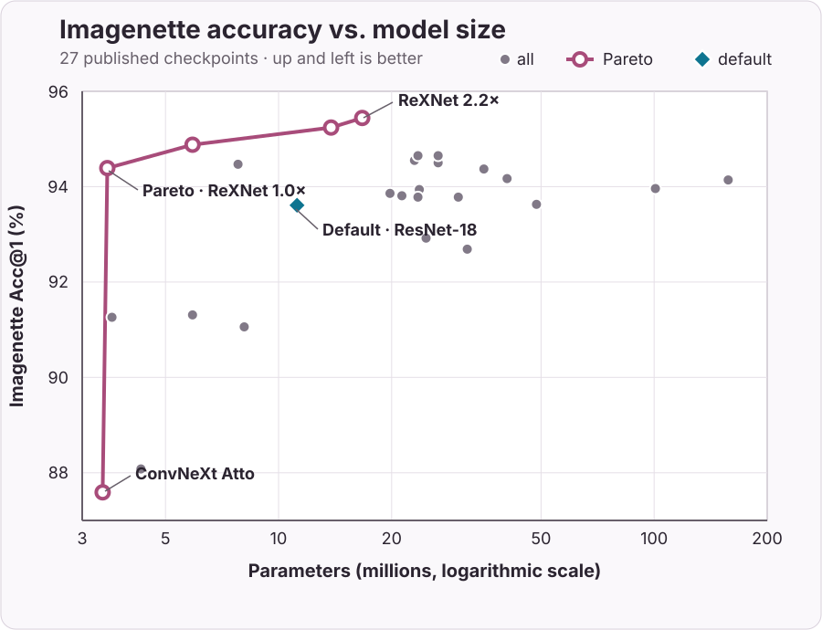

# holocron.models

The models subpackage contains definitions of models for addressing
different tasks, including: image classification, pixelwise semantic
segmentation and object detection.

## Programmatic discovery

Model discovery uses the public task modules as its source of truth, so agents
and applications do not need to inspect module internals:

```python
from holocron.models import Maturity, get_model, get_model_info, list_checkpoints, list_models

names = list_models(task="classification", maturity=Maturity.VALIDATED, pretrained=True)
checkpoint = list_checkpoints(names[0])[0]
model = get_model(names[0], checkpoint=checkpoint)
info = get_model_info(names[0])
```

Maturity is assigned to each model from its available evidence. Classification
models with typed evaluation-backed checkpoints are `validated`; other
classification models and segmentation models are `preview`; detection models
remain `experimental` until standard benchmark evidence is published.

## Support status

| Task | Architectures | Published checkpoints | Training | ONNX | Status |
|---|---|---|---|---|---|
| Classification | 15 families | Imagenette checkpoints with top-1/top-5 metrics; selected ReXNet ImageNet-1K checkpoints | [Reference script](https://github.com/frgfm/holocron/blob/main/references/classification/train.py) | [Classification export](https://github.com/frgfm/holocron/blob/main/scripts/export_to_onnx.py) | **Validated** |
| Semantic segmentation | U-Net, U-Net++, UNet3+ | Only the legacy `unet_rexnet13` weights; dataset and metric are not documented | [Reference script](https://github.com/frgfm/holocron/blob/main/references/segmentation/train.py) | Not documented | **Unbenchmarked** |
| Object detection | YOLOv1, YOLOv2, YOLOv4 | None | [Reference script](https://github.com/frgfm/holocron/blob/main/references/detection/train.py) | Not documented | **Experimental** ([#110](https://github.com/frgfm/holocron/issues/110), [#253](https://github.com/frgfm/holocron/issues/253), [discussion #230](https://github.com/frgfm/holocron/discussions/230)) |

**Validated** means published task checkpoints and metrics are available.
**Unbenchmarked** means an implementation or legacy weight exists without a
documented evaluation dataset and metric. **Experimental** means the API is
available, but published task weights and a confirmed benchmark are not.


## Classification

Classification models expect a 4D image tensor as an input (N x C x H x W) and returns a 2D output (N x K).
The output represents the classification scores for each output classes.

### Supported architectures
* [ResNet](./classification/resnet.md)
* [ResNeXt](./classification/resnext.md)
* [Res2Net](./classification/res2net.md)
* [TridentNet](./classification/tridentnet.md)
* [ConvNeXt](./classification/convnext.md)
* [PyConvResNet](./classification/pyconv_resnet.md)
* [ReXNet](./classification/rexnet.md)
* [SKNet](./classification/sknet.md)
* [DarkNet](./classification/darknet.md)
* [DarkNetV2](./classification/darknetv2.md)
* [DarkNetV3](./classification/darknetv3.md)
* [DarkNetV4](./classification/darknetv4.md)
* [RepVGG](./classification/repvgg.md)
* [MobileOne](./classification/mobileone.md)
* [RepViT](./classification/repvit.md)

### Available checkpoints

Here is the list of available checkpoints:

The chart compares only the 27 Imagenette checkpoints. ImageNet-1K rows remain
in the table for reference but use a different evaluation dataset.



| **Checkpoint** | **Acc@1** | **Acc@5** | **Params** | **Size (MB)** |
|---|---|---|---|---|
| [`CSPDarknet53_Checkpoint.IMAGENETTE`][holocron.models.classification.CSPDarknet53_Checkpoint.IMAGENETTE] | 94.50% | 99.64% | 26.6M | 101.8 |
| [`CSPDarknet53_Mish_Checkpoint.IMAGENETTE`][holocron.models.classification.CSPDarknet53_Mish_Checkpoint.IMAGENETTE] | 94.65% | 99.69% | 26.6M | 101.8 |
| [`ConvNeXt_Atto_Checkpoint.IMAGENETTE`][holocron.models.classification.ConvNeXt_Atto_Checkpoint.IMAGENETTE] | 87.59% | 98.32% | 3.4M | 12.9 |
| [`Darknet19_Checkpoint.IMAGENETTE`][holocron.models.classification.Darknet19_Checkpoint.IMAGENETTE] | 93.86% | 99.36% | 19.8M | 75.7 |
| [`Darknet53_Checkpoint.IMAGENETTE`][holocron.models.classification.Darknet53_Checkpoint.IMAGENETTE] | 94.17% | 99.57% | 40.6M | 155.1 |
| [`MobileOne_S0_Checkpoint.IMAGENETTE`][holocron.models.classification.MobileOne_S0_Checkpoint.IMAGENETTE] | 88.08% | 98.83% | 4.3M | 16.9 |
| [`MobileOne_S1_Checkpoint.IMAGENETTE`][holocron.models.classification.MobileOne_S1_Checkpoint.IMAGENETTE] | 91.26% | 99.18% | 3.6M | 13.9 |
| [`MobileOne_S2_Checkpoint.IMAGENETTE`][holocron.models.classification.MobileOne_S2_Checkpoint.IMAGENETTE] | 91.31% | 99.21% | 5.9M | 22.8 |
| [`MobileOne_S3_Checkpoint.IMAGENETTE`][holocron.models.classification.MobileOne_S3_Checkpoint.IMAGENETTE] | 91.06% | 99.31% | 8.1M | 31.5 |
| [`ReXNet1_0x_Checkpoint.IMAGENET1K`][holocron.models.classification.ReXNet1_0x_Checkpoint.IMAGENET1K] | 77.86% | 93.87% | 4.8M | 13.7 |
| [`ReXNet1_0x_Checkpoint.IMAGENETTE`][holocron.models.classification.ReXNet1_0x_Checkpoint.IMAGENETTE] | 94.39% | 99.62% | 3.5M | 13.7 |
| [`ReXNet1_3x_Checkpoint.IMAGENET1K`][holocron.models.classification.ReXNet1_3x_Checkpoint.IMAGENET1K] | 79.50% | 94.68% | 7.6M | 13.7 |
| [`ReXNet1_3x_Checkpoint.IMAGENETTE`][holocron.models.classification.ReXNet1_3x_Checkpoint.IMAGENETTE] | 94.88% | 99.39% | 5.9M | 22.8 |
| [`ReXNet1_5x_Checkpoint.IMAGENET1K`][holocron.models.classification.ReXNet1_5x_Checkpoint.IMAGENET1K] | 80.31% | 95.17% | 9.7M | 13.7 |
| [`ReXNet1_5x_Checkpoint.IMAGENETTE`][holocron.models.classification.ReXNet1_5x_Checkpoint.IMAGENETTE] | 94.47% | 99.62% | 7.8M | 30.2 |
| [`ReXNet2_0x_Checkpoint.IMAGENET1K`][holocron.models.classification.ReXNet2_0x_Checkpoint.IMAGENET1K] | 80.31% | 95.17% | 16.4M | 13.7 |
| [`ReXNet2_0x_Checkpoint.IMAGENETTE`][holocron.models.classification.ReXNet2_0x_Checkpoint.IMAGENETTE] | 95.24% | 99.57% | 13.8M | 53.1 |
| [`ReXNet2_2x_Checkpoint.IMAGENETTE`][holocron.models.classification.ReXNet2_2x_Checkpoint.IMAGENETTE] | 95.44% | 99.46% | 16.7M | 64.1 |
| [`RepVGG_A0_Checkpoint.IMAGENETTE`][holocron.models.classification.RepVGG_A0_Checkpoint.IMAGENETTE] | 92.92% | 99.46% | 24.7M | 94.6 |
| [`RepVGG_A1_Checkpoint.IMAGENETTE`][holocron.models.classification.RepVGG_A1_Checkpoint.IMAGENETTE] | 93.78% | 99.18% | 30.1M | 115.1 |
| [`RepVGG_A2_Checkpoint.IMAGENETTE`][holocron.models.classification.RepVGG_A2_Checkpoint.IMAGENETTE] | 93.63% | 99.39% | 48.6M | 185.8 |
| [`RepVGG_B0_Checkpoint.IMAGENETTE`][holocron.models.classification.RepVGG_B0_Checkpoint.IMAGENETTE] | 92.69% | 99.21% | 31.8M | 121.8 |
| [`RepVGG_B1_Checkpoint.IMAGENETTE`][holocron.models.classification.RepVGG_B1_Checkpoint.IMAGENETTE] | 93.96% | 99.39% | 100.8M | 385.1 |
| [`RepVGG_B2_Checkpoint.IMAGENETTE`][holocron.models.classification.RepVGG_B2_Checkpoint.IMAGENETTE] | 94.14% | 99.57% | 157.5M | 601.2 |
| [`Res2Net50_26w_4s_Checkpoint.IMAGENETTE`][holocron.models.classification.Res2Net50_26w_4s_Checkpoint.IMAGENETTE] | 93.94% | 99.41% | 23.7M | 90.6 |
| [`ResNeXt50_32x4d_Checkpoint.IMAGENETTE`][holocron.models.classification.ResNeXt50_32x4d_Checkpoint.IMAGENETTE] | 94.55% | 99.49% | 23.0M | 88.1 |
| [`ResNet18_Checkpoint.IMAGENETTE`][holocron.models.classification.ResNet18_Checkpoint.IMAGENETTE] | 93.61% | 99.46% | 11.2M | 42.7 |
| [`ResNet34_Checkpoint.IMAGENETTE`][holocron.models.classification.ResNet34_Checkpoint.IMAGENETTE] | 93.81% | 99.49% | 21.3M | 81.3 |
| [`ResNet50D_Checkpoint.IMAGENETTE`][holocron.models.classification.ResNet50D_Checkpoint.IMAGENETTE] | 94.65% | 99.52% | 23.5M | 90.1 |
| [`ResNet50_Checkpoint.IMAGENETTE`][holocron.models.classification.ResNet50_Checkpoint.IMAGENETTE] | 93.78% | 99.54% | 23.5M | 90 |
| [`SKNet50_Checkpoint.IMAGENETTE`][holocron.models.classification.SKNet50_Checkpoint.IMAGENETTE] | 94.37% | 99.54% | 35.2M | 134.7 |


## Object Detection

!!! warning "Experimental"
    YOLOv1, YOLOv2 and YOLOv4 have a reference training script but no
    published detection weights. Known training and benchmark gaps are tracked
    in [#110](https://github.com/frgfm/holocron/issues/110),
    [#253](https://github.com/frgfm/holocron/issues/253) and
    [discussion #230](https://github.com/frgfm/holocron/discussions/230).

Object detection models expect a 4D image tensor as an input (N x C x H x W) and returns a list of dictionaries.
Each dictionary has 3 keys: box coordinates, classification probability, classification label.

```python
import holocron.models as models

yolov2 = models.yolov2(num_classes=10)
```

### YOLO family

::: holocron.models.detection.yolo.YOLOv1
    options:
        heading_level: 4
        members: no
        show_bases: false

::: holocron.models.detection.yolo.yolov1
    options:
        heading_level: 4

::: holocron.models.detection.yolov2.YOLOv2
    options:
        heading_level: 4
        members: no
        show_bases: false

::: holocron.models.detection.yolov2.yolov2
    options:
        heading_level: 4

::: holocron.models.detection.yolov4.YOLOv4
    options:
        heading_level: 4
        members: no
        show_bases: false

::: holocron.models.detection.yolov4.yolov4
    options:
        heading_level: 4


## Semantic Segmentation

!!! note "Unbenchmarked"
    `unet_rexnet13` is the only segmentation model with a legacy checkpoint.
    Its training dataset and evaluation metric are not documented. Other
    segmentation architectures have no published weights.

Semantic segmentation models expect a 4D image tensor as an input (N x C x H x W) and returns a classification score
tensor of size (N x K x Ho x Wo).

```python
import holocron.models as models

unet = models.unet(num_classes=10)
```

### U-Net family

::: holocron.models.segmentation.unet.UNet
    options:
        heading_level: 4
        members: no
        show_bases: false

::: holocron.models.segmentation.unet.unet
    options:
        heading_level: 4

::: holocron.models.segmentation.unet.DynamicUNet
    options:
        heading_level: 4
        members: no
        show_bases: false

::: holocron.models.segmentation.unet.unet2
    options:
        heading_level: 4

::: holocron.models.segmentation.unet.unet_tvvgg11
    options:
        heading_level: 4

::: holocron.models.segmentation.unet.unet_tvresnet34
    options:
        heading_level: 4

::: holocron.models.segmentation.unet.unet_rexnet13
    options:
        heading_level: 4


::: holocron.models.segmentation.unetpp.UNetp
    options:
        heading_level: 4
        members: no
        show_bases: false

::: holocron.models.segmentation.unetpp.unetp
    options:
        heading_level: 4

::: holocron.models.segmentation.unetpp.UNetpp
    options:
        heading_level: 4
        members: no
        show_bases: false

::: holocron.models.segmentation.unetpp.unetpp
    options:
        heading_level: 4

::: holocron.models.segmentation.unet3p.UNet3p
    options:
        heading_level: 4
        members: no
        show_bases: false

::: holocron.models.segmentation.unet3p.unet3p
    options:
        heading_level: 4
