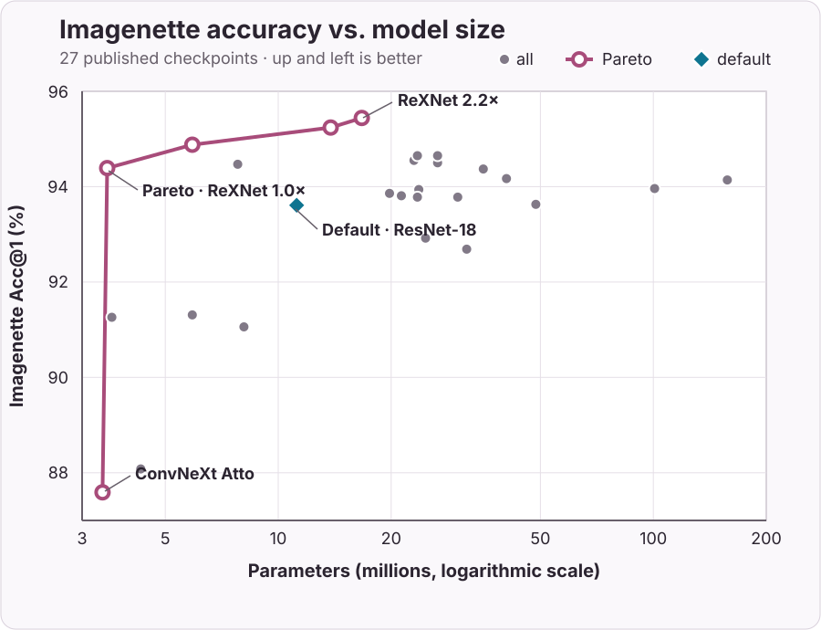

# holocron.models

The models subpackage contains definitions of models for addressing
different tasks, including: image classification, pixelwise semantic
segmentation, object detection, and text recognition.

## Support status

| Task | Architectures | Published checkpoints | Training | ONNX | Status |
|---|---|---|---|---|---|
| Classification | 15 families | Imagenette checkpoints with top-1/top-5 metrics; selected ReXNet ImageNet-1K checkpoints | [Reference script](https://github.com/frgfm/holocron/blob/main/references/classification/train.py) | [Classification export](https://github.com/frgfm/holocron/blob/main/scripts/export_to_onnx.py) | **Validated** |
| Semantic segmentation | U-Net, U-Net++, UNet3+, [YOLO26 nano](segmentation/yolo26.md) | Only the legacy `unet_rexnet13` weights; dataset and metric are not documented | [Reference script](https://github.com/frgfm/holocron/blob/main/references/segmentation/train.py) | YOLO26 export and CPU reference parity tested | **Unbenchmarked** on standard benchmarks; YOLO26 small-data learning checks available |
| Object detection | YOLOv1, YOLOv2, YOLOv4 | None | [Reference script](https://github.com/frgfm/holocron/blob/main/references/detection/train.py) | [Export tests](https://github.com/frgfm/holocron/blob/main/tests/test_models_detection.py); runtime parity not benchmarked | **Experimental**; [YOLOv4 learning check verified](#yolo-training-validation) |
| [Text recognition](recognition.md) | Shared glyph CNN, BiGRU/CTC | None; training produces local checkpoints | [Synthetic curriculum](https://github.com/frgfm/holocron/tree/main/references/recognition) | Not validated | **Experimental**; synthetic CPU benchmark |

**Validated** means published task checkpoints and metrics are available.
**Unbenchmarked** means an implementation or legacy weight exists without a
documented evaluation dataset and metric. **Experimental** means the API is
available, but published task weights and a confirmed benchmark are not.


## Classification

Classification models expect a 4D image tensor as an input (N x C x H x W) and returns a 2D output (N x K).
The output represents the classification scores for each output classes.

### Supported architectures
* [ResNet](./classification/resnet.md)
* [ResNeXt](./classification/resnext.md)
* [Res2Net](./classification/res2net.md)
* [TridentNet](./classification/tridentnet.md)
* [ConvNeXt](./classification/convnext.md)
* [PyConvResNet](./classification/pyconv_resnet.md)
* [ReXNet](./classification/rexnet.md)
* [SKNet](./classification/sknet.md)
* [DarkNet](./classification/darknet.md)
* [DarkNetV2](./classification/darknetv2.md)
* [DarkNetV3](./classification/darknetv3.md)
* [DarkNetV4](./classification/darknetv4.md)
* [RepVGG](./classification/repvgg.md)
* [MobileOne](./classification/mobileone.md)
* [RepViT](./classification/repvit.md)

### Available checkpoints

Most classification checkpoints were trained on [Imagenette](https://github.com/fastai/imagenette),
a ten-class subset of ImageNet. Selected ReXNet variants also provide ImageNet-1K
weights with 1,000 output classes. Choose a checkpoint by its dataset, not just
its architecture name. Accuracy values from these two datasets are not comparable.

Pass a `Checkpoint` object, for example
`rexnet1_0x(checkpoint=ReXNet1_0x_Checkpoint.IMAGENETTE.value)`, to select weights
explicitly. For models with checkpoint enums, `pretrained=True`
selects `DEFAULT.value`; it does not always select Imagenette. The checkpoint
defines the preprocessing, output categories and evaluation metrics. See the
[quick start](../../index.md#quick-start) for inference and the
[transfer-learning guide](../../getting-started/classification.md) to replace the
classifier after loading weights.

Weights may be trained in Holocron or ported from another implementation. A
matching architecture name does not make a torchvision or `timm` state dictionary
compatible: parameter names, shapes and preprocessing may differ. Use the
published Holocron checkpoint or a documented adapter, such as
[RepViT's official checkpoint import](classification/repvit.md#use-the-authors-checkpoint).

An implemented architecture does not guarantee pretrained weights. When no
weights are available, legacy weight loaders log
`Invalid model URL, using default initialization.` and keep the model's initial
parameters. The YOLO26 detection and segmentation builders instead raise
`ValueError` for `pretrained=True`. Check the model's checkpoint documentation
before using it for inference; train models without weights with the
[reference scripts](https://github.com/frgfm/Holocron/tree/main/references).

The table below lists classification checkpoints with recorded metrics.
`darknet24` and `tridentnet50` also have legacy Imagenette weights, but no
recorded evaluation metrics. Their `model.default_cfg` is a dictionary with
`input_shape`, `mean`, `std` and `classes` keys, rather than a `Checkpoint` object.

The chart compares only the 27 Imagenette checkpoints. ImageNet-1K rows remain
in the table for reference but use a different evaluation dataset.



| **Checkpoint** | **Acc@1** | **Acc@5** | **Params** | **Size (MB)** |
|---|---|---|---|---|
| [`CSPDarknet53_Checkpoint.IMAGENETTE`][holocron.models.CSPDarknet53_Checkpoint.IMAGENETTE] | 94.50% | 99.64% | 26.6M | 101.8 |
| [`CSPDarknet53_Mish_Checkpoint.IMAGENETTE`][holocron.models.CSPDarknet53_Mish_Checkpoint.IMAGENETTE] | 94.65% | 99.69% | 26.6M | 101.8 |
| [`ConvNeXt_Atto_Checkpoint.IMAGENETTE`][holocron.models.ConvNeXt_Atto_Checkpoint.IMAGENETTE] | 87.59% | 98.32% | 3.4M | 12.9 |
| [`Darknet19_Checkpoint.IMAGENETTE`][holocron.models.Darknet19_Checkpoint.IMAGENETTE] | 93.86% | 99.36% | 19.8M | 75.7 |
| [`Darknet53_Checkpoint.IMAGENETTE`][holocron.models.Darknet53_Checkpoint.IMAGENETTE] | 94.17% | 99.57% | 40.6M | 155.1 |
| [`MobileOne_S0_Checkpoint.IMAGENETTE`][holocron.models.MobileOne_S0_Checkpoint.IMAGENETTE] | 88.08% | 98.83% | 4.3M | 16.9 |
| [`MobileOne_S1_Checkpoint.IMAGENETTE`][holocron.models.MobileOne_S1_Checkpoint.IMAGENETTE] | 91.26% | 99.18% | 3.6M | 13.9 |
| [`MobileOne_S2_Checkpoint.IMAGENETTE`][holocron.models.MobileOne_S2_Checkpoint.IMAGENETTE] | 91.31% | 99.21% | 5.9M | 22.8 |
| [`MobileOne_S3_Checkpoint.IMAGENETTE`][holocron.models.MobileOne_S3_Checkpoint.IMAGENETTE] | 91.06% | 99.31% | 8.1M | 31.5 |
| [`ReXNet1_0x_Checkpoint.IMAGENET1K`][holocron.models.ReXNet1_0x_Checkpoint.IMAGENET1K] | 77.86% | 93.87% | 4.8M | 13.7 |
| [`ReXNet1_0x_Checkpoint.IMAGENETTE`][holocron.models.ReXNet1_0x_Checkpoint.IMAGENETTE] | 94.39% | 99.62% | 3.5M | 13.7 |
| [`ReXNet1_3x_Checkpoint.IMAGENET1K`][holocron.models.ReXNet1_3x_Checkpoint.IMAGENET1K] | 79.50% | 94.68% | 7.6M | 13.7 |
| [`ReXNet1_3x_Checkpoint.IMAGENETTE`][holocron.models.ReXNet1_3x_Checkpoint.IMAGENETTE] | 94.88% | 99.39% | 5.9M | 22.8 |
| [`ReXNet1_5x_Checkpoint.IMAGENET1K`][holocron.models.ReXNet1_5x_Checkpoint.IMAGENET1K] | 80.31% | 95.17% | 9.7M | 13.7 |
| [`ReXNet1_5x_Checkpoint.IMAGENETTE`][holocron.models.ReXNet1_5x_Checkpoint.IMAGENETTE] | 94.47% | 99.62% | 7.8M | 30.2 |
| [`ReXNet2_0x_Checkpoint.IMAGENET1K`][holocron.models.ReXNet2_0x_Checkpoint.IMAGENET1K] | 80.31% | 95.17% | 16.4M | 13.7 |
| [`ReXNet2_0x_Checkpoint.IMAGENETTE`][holocron.models.ReXNet2_0x_Checkpoint.IMAGENETTE] | 95.24% | 99.57% | 13.8M | 53.1 |
| [`ReXNet2_2x_Checkpoint.IMAGENETTE`][holocron.models.ReXNet2_2x_Checkpoint.IMAGENETTE] | 95.44% | 99.46% | 16.7M | 64.1 |
| [`RepVGG_A0_Checkpoint.IMAGENETTE`][holocron.models.RepVGG_A0_Checkpoint.IMAGENETTE] | 92.92% | 99.46% | 24.7M | 94.6 |
| [`RepVGG_A1_Checkpoint.IMAGENETTE`][holocron.models.RepVGG_A1_Checkpoint.IMAGENETTE] | 93.78% | 99.18% | 30.1M | 115.1 |
| [`RepVGG_A2_Checkpoint.IMAGENETTE`][holocron.models.RepVGG_A2_Checkpoint.IMAGENETTE] | 93.63% | 99.39% | 48.6M | 185.8 |
| [`RepVGG_B0_Checkpoint.IMAGENETTE`][holocron.models.RepVGG_B0_Checkpoint.IMAGENETTE] | 92.69% | 99.21% | 31.8M | 121.8 |
| [`RepVGG_B1_Checkpoint.IMAGENETTE`][holocron.models.RepVGG_B1_Checkpoint.IMAGENETTE] | 93.96% | 99.39% | 100.8M | 385.1 |
| [`RepVGG_B2_Checkpoint.IMAGENETTE`][holocron.models.RepVGG_B2_Checkpoint.IMAGENETTE] | 94.14% | 99.57% | 157.5M | 601.2 |
| [`Res2Net50_26w_4s_Checkpoint.IMAGENETTE`][holocron.models.Res2Net50_26w_4s_Checkpoint.IMAGENETTE] | 93.94% | 99.41% | 23.7M | 90.6 |
| [`ResNeXt50_32x4d_Checkpoint.IMAGENETTE`][holocron.models.ResNeXt50_32x4d_Checkpoint.IMAGENETTE] | 94.55% | 99.49% | 23.0M | 88.1 |
| [`ResNet18_Checkpoint.IMAGENETTE`][holocron.models.ResNet18_Checkpoint.IMAGENETTE] | 93.61% | 99.46% | 11.2M | 42.7 |
| [`ResNet34_Checkpoint.IMAGENETTE`][holocron.models.ResNet34_Checkpoint.IMAGENETTE] | 93.81% | 99.49% | 21.3M | 81.3 |
| [`ResNet50D_Checkpoint.IMAGENETTE`][holocron.models.ResNet50D_Checkpoint.IMAGENETTE] | 94.65% | 99.52% | 23.5M | 90.1 |
| [`ResNet50_Checkpoint.IMAGENETTE`][holocron.models.ResNet50_Checkpoint.IMAGENETTE] | 93.78% | 99.54% | 23.5M | 90 |
| [`SKNet50_Checkpoint.IMAGENETTE`][holocron.models.SKNet50_Checkpoint.IMAGENETTE] | 94.37% | 99.54% | 35.2M | 134.7 |


## Object Detection

!!! warning "Experimental"
    YOLOv4's corrected implementation passes regression tests and a CPU
    fixed-batch learning check. Full CUDA/VOC training on the repaired
    implementation remains pending. No pretrained detection checkpoints or
    paper-level accuracy results are published.

Object detection models expect a 4D image tensor as an input (N x C x H x W) and returns a list of dictionaries.
In evaluation mode, each dictionary has three keys: `boxes` (normalized xmin, ymin, xmax, ymax coordinates),
`scores` (objectness multiplied by the top class probability for YOLOv1/v2/v4;
class probability for YOLO26), and `labels` (class indices).
In training mode, pass a list of target dictionaries with normalized `boxes` and integer `labels`;
the model returns a loss dictionary.

```python
import holocron.models as models

yolov2 = models.yolov2(num_classes=10)
```

### YOLO training validation

YOLOv4 uses a CSPDarknet53-Mish backbone with an SPP/PAN neck and three detection scales.
Its corrected training uses global and additional anchor matches, constant objectness BCE targets,
summed classification BCE, and area-weighted differentiable CIoU. Box geometry is computed in
FP32 under AMP, and every scale is decoded before combined-confidence filtering and class-aware NMS.

The default `yolov4(num_classes=20)` loads a pretrained **Imagenette backbone**, even without
`pretrained=True`. The detector head starts from scratch. The reference script's
`--freeze-until backbone` freezes the pretrained weights; `--pretrained` should not be used to
request unavailable detection weights.

The [CPU learning diagnostic](https://github.com/frgfm/holocron/blob/main/references/detection/check_yolov4.py)
trains the actual neck and head for 500 SGD updates on two synthetic 96-pixel rectangle images,
repeated to a batch of eight. It caches the frozen backbone features and disables DropBlock
only for this memorization check. Normal evaluation and default NMS give one correctly labeled
detection per image, with IoUs **0.8113 / 0.7945**, no false positives, and finite losses and
parameter gradients. The pretrained backbone weights remain unchanged, and a trainer checkpoint is saved.

| Validation | Result |
| --- | --- |
| YOLOv4 fixed-batch learning | Verified; detection error 99.43% with the old initialization restored, versus 0% with corrected initialization |
| YOLOv1/v2 losses and shared inference | Loss behavior preserved; regression coverage for combined confidence and class-aware NMS |
| YOLOv1/v2/v4 ONNX | Export tested; inference parity and accuracy not benchmarked |
| Full CUDA/VOC training of the repaired YOLOv4 | Pending; synthetic results do not establish validation-set accuracy |

YOLOv3 is not implemented as a detector. Its Darknet-53 classification backbone is available.
The [detection guide](https://github.com/frgfm/holocron/blob/main/references/detection/README.md)
contains the matched-control results, reproducible commands, learning-rate finder options,
metric definitions, and the five-epoch CUDA/VOC acceptance gate.

### YOLO family

[YOLO26 nano](detection/yolo26.md) adds dual-head training and NMS-free inference,
with 2.41M parameters in its fused 80-class inference model. Its full published
training recipe and pretrained weights are not included.

::: holocron.models.detection.yolo.YOLOv1
    options:
        heading_level: 4
        members: no
        show_bases: false

::: holocron.models.detection.yolo.yolov1
    options:
        heading_level: 4

::: holocron.models.detection.yolov2.YOLOv2
    options:
        heading_level: 4
        members: no
        show_bases: false

::: holocron.models.detection.yolov2.yolov2
    options:
        heading_level: 4

::: holocron.models.detection.yolov4.YOLOv4
    options:
        heading_level: 4
        members: no
        show_bases: false

::: holocron.models.detection.yolov4.yolov4
    options:
        heading_level: 4


## Semantic Segmentation

!!! note "Unbenchmarked"
    `unet_rexnet13` is the only segmentation model with a legacy checkpoint.
    Its training dataset and evaluation metric are not documented. Other
    segmentation architectures have no published weights.

Semantic segmentation models expect a 4D image tensor as an input (N x C x H x W) and returns a classification score
tensor of size (N x K x Ho x Wo).

```python
import holocron.models as models

unet = models.unet(num_classes=10)
```

### U-Net family

::: holocron.models.segmentation.unet.UNet
    options:
        heading_level: 4
        members: no
        show_bases: false

::: holocron.models.segmentation.unet.unet
    options:
        heading_level: 4

::: holocron.models.segmentation.unet.DynamicUNet
    options:
        heading_level: 4
        members: no
        show_bases: false

::: holocron.models.segmentation.unet.unet2
    options:
        heading_level: 4

::: holocron.models.segmentation.unet.unet_tvvgg11
    options:
        heading_level: 4

::: holocron.models.segmentation.unet.unet_tvresnet34
    options:
        heading_level: 4

::: holocron.models.segmentation.unet.unet_rexnet13
    options:
        heading_level: 4


::: holocron.models.segmentation.unetpp.UNetp
    options:
        heading_level: 4
        members: no
        show_bases: false

::: holocron.models.segmentation.unetpp.unetp
    options:
        heading_level: 4

::: holocron.models.segmentation.unetpp.UNetpp
    options:
        heading_level: 4
        members: no
        show_bases: false

::: holocron.models.segmentation.unetpp.unetpp
    options:
        heading_level: 4

::: holocron.models.segmentation.unet3p.UNet3p
    options:
        heading_level: 4
        members: no
        show_bases: false

::: holocron.models.segmentation.unet3p.unet3p
    options:
        heading_level: 4

### YOLO26 family

See [YOLO26 nano semantic segmentation](segmentation/yolo26.md) for the model
API, training output, parameter counts, and deployment limits.
