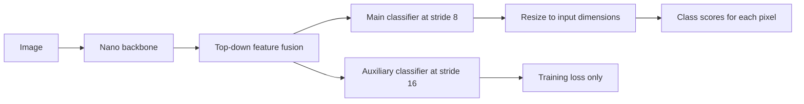

# YOLO26 nano semantic segmentation

`yolo26n_sem` gives each image pixel a class score. For example, a two-class
model can separate people from the background. It returns full image masks,
not separate masks for individual people.

This implementation follows the nano backbone, top-down feature fusion, and
semantic classifiers specified by
[YOLO26](https://arxiv.org/abs/2606.03748). The architecture reference is pinned
to [upstream revision abd16e0](https://github.com/ultralytics/ultralytics/blob/abd16e057bc0fde135c557d95e1fac31413d8575/ultralytics/cfg/models/26/yolo26-sem.yaml).
The PyTorch implementation was written independently. Upstream checkpoints
cannot be loaded directly. Holocron does not provide pretrained weights.

```python
import torch
from holocron.models.segmentation import yolo26n_sem

model = yolo26n_sem(num_classes=19).eval()
with torch.inference_mode():
    scores = model(torch.rand(1, 3, 128, 192))
    labels = scores.argmax(dim=1)  # [1, 128, 192]
```

The model accepts rectangular images and odd image dimensions. It resizes
scores to the exact input height and width. In training mode, the default
model returns `{"out": main_scores, "aux": auxiliary_scores}`. Both have shape
`[batch, classes, height, width]`. In evaluation mode, it returns only the main
score tensor. Set `auxiliary=False` to return a tensor in both modes.



## Training

The existing segmentation trainer adds the main cross-entropy loss and
`0.5` times the auxiliary loss. Labels equal to `255` are ignored. See the
[training guide](https://github.com/frgfm/holocron/tree/main/references/segmentation)
for the VOC training command and reproducible learning checks.

The checked-in experiments use random initial weights. The synthetic run has
separate training and validation images. The real-image run uses 120 Penn-Fudan
images for training, 25 for model selection, and 25 for the final test.
These checks show that the model learns. They do not reproduce Cityscapes or
ADE20K accuracy, or establish hardware throughput.

| Learning check | Held-out result |
| --- | --- |
| Synthetic shapes, 24 validation images | **95.02% mean IoU** |
| Penn-Fudan, 25 test images | **76.01% mean IoU**, **59.94% person IoU** |

## Deployment

For 19 classes, the model has **1,632,902 parameters** during training.
After folding convolution/BatchNorm pairs and removing the auxiliary head,
it has **1,552,795 parameters**, which rounds to the published 1.6 million.
The larger parameter number in the upstream YAML summary comment is not the
count of this semantic model.

```python
model.eval().fuse()  # In-place conversion for inference
torch.save(model.state_dict(), "semantic-fused.pth")

loaded = yolo26n_sem(num_classes=19).eval().fuse()
loaded.load_state_dict(torch.load("semantic-fused.pth", weights_only=True))
```

Construct and fuse the destination model before loading fused weights. Keep
an unfused checkpoint if further training is needed. CPU tests check fused
prediction parity, saved-state reload, ONNX export and ONNX reference evaluator
parity. CUDA, TensorRT, quantization, and upstream weight conversion are not
validated here.

::: holocron.models.segmentation.yolo26.YOLO26Semantic
    options:
        heading_level: 3
        members: no
        show_bases: false

::: holocron.models.segmentation.yolo26.yolo26n_sem
    options:
        heading_level: 3
