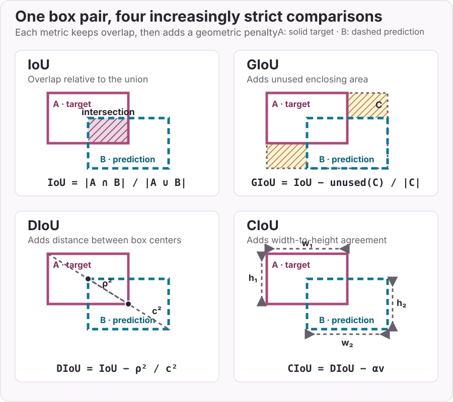

# holocron.ops

`holocron.ops` implements operators that are specific for Computer Vision.

!!! note
    Those operators currently do not support TorchScript.

## Boxes

::: holocron.ops
    options:
        heading_level: 3
        show_root_heading: false
        show_root_toc_entry: false
        members:
            - box_giou
            - diou_loss
            - ciou_loss
