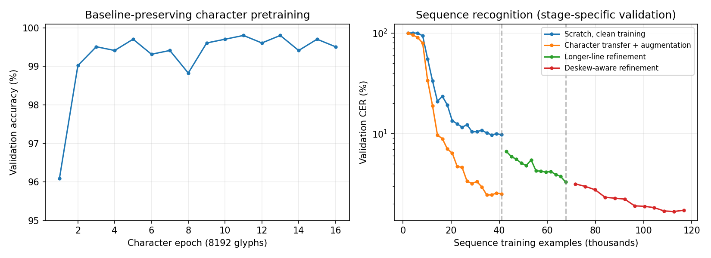

# Synthetic OCR experiment results

On degraded synthetic pages, the final model reduces character error rate (CER) from **8.32% to 1.06%** on training font families and from **9.40% to 1.06%** on held-out families. Entire page transcripts are exact in **64%** and **53%** of cases, respectively. This is substantial progress toward page OCR, with residual errors that still require review.

Measured on 2026-10-03 using an AMD EPYC 9V74 CPU, four CPU cores of quota, Python 3.11.16, PyTorch 2.13.0+cu130 running on CPU, and Pillow 12.3.0. No GPU run or real scanned-document benchmark was performed. The classifier has 167,483 parameters; the line recognizer has 498,236.

## Protocol

The manifest pins ten font files and their checksums. Training uses eight complete families; Noto Serif and Ubuntu are held out from every training stage. Validation uses only training families. Character evaluation uses 8,192 independently seeded glyphs per condition (seed 300000). The primary OCR evaluation uses 2,000 lines and 200 pages per condition (seed 400000), with paired text labels across clean/degraded renderings. Each page contains three to six lines; page generation uses an independent offset seed.

During development, seed 300000 was inspected for early OCR diagnostics. The reported OCR comparison uses fresh seed 400000 after choosing normalization and detection rules on training-family validation data. The final long-line stress test uses another fresh seed, 500000. Neither final OCR seed was used for selecting weights or preprocessing settings. All reported OCR scores use greedy decoding and image-derived line boxes. Synthetic boxes are used only to count detection errors.

CER is total character edit distance divided by total reference characters. WER uses whitespace-delimited words. Page CER includes newlines. Exact match requires an entirely correct transcript. The default alphabet covers 82 visible ASCII glyphs and ordinary space; it is not all Unicode or all printable ASCII. The renderer mixes document fields and arbitrary strings, and the JSON reports provide separate field/random-string scores.

## Character recognition

| Font split | Clean accuracy | Degraded accuracy |
| --- | ---: | ---: |
| Seen | 99.85% | 99.79% |
| Held-out | 98.85% | 98.96% |

Preserving baseline position avoids making punctuation such as hyphen and underscore indistinguishable. Fonts with missing glyphs or identical upper/lowercase shapes are rejected. Remaining character confusions include `0` versus `O`.

## Line recognition: identical evaluation images

| Font split / condition | Scratch, no augmentation CER | Transfer + augmentation CER | Final curriculum CER | Final exact lines |
| --- | ---: | ---: | ---: | ---: |
| Seen / clean | 0.72% | 1.29% | 0.48% | 93.80% |
| Seen / degraded | 8.99% | 2.44% | 1.03% | 90.70% |
| Held-out / clean | 2.31% | 2.55% | 1.12% | 86.15% |
| Held-out / degraded | 10.12% | 2.75% | 1.07% | 86.75% |

The scratch and initial transfer runs each train on 40,960 lines over 1,280 optimization steps. Transfer additionally uses 131,072 character-pretraining examples and enables augmentation. That comparison measures their combined effect, rather than isolating the two contributions. Augmentation trades some initial clean accuracy for a large improvement under degradation. The final curriculum uses further training; its improvement is not attributed to an equal compute budget.

## Full-page transcription

| Font split / condition | Scratch CER | Scratch exact pages | Transfer CER | Transfer exact pages | Final CER | Final exact pages |
| --- | ---: | ---: | ---: | ---: | ---: | ---: |
| Seen / clean | 1.04% | 56.50% | 1.36% | 46.50% | 0.52% | 74.50% |
| Seen / degraded | 8.32% | 7.50% | 2.03% | 42.00% | 1.06% | 64.00% |
| Held-out / clean | 2.34% | 27.50% | 2.66% | 24.50% | 1.18% | 52.00% |
| Held-out / degraded | 9.40% | 3.00% | 2.77% | 26.50% | 1.06% | 53.00% |

The corrected projection detector has zero line-count errors in every 200-page condition above. It preserves thin single-pixel strokes and joins small punctuation fragments. On 500 separate training-family validation pages, the previous detector miscounted 47 pages; the corrected detector miscounts zero. Matching the line count does not establish perfect box localization; transcript CER and exact match provide the end-to-end check.

## Longer-line stress test

The final model also reads randomly generated strings up to 48 characters. Each condition has 1,000 lines and 100 pages (seed 500000).

| Font split / condition | Line CER | Exact lines | Page CER | Exact pages |
| --- | ---: | ---: | ---: | ---: |
| Seen / clean | 0.59% | 91.20% | 0.52% | 66.00% |
| Seen / degraded | 1.32% | 84.70% | 1.56% | 41.00% |
| Held-out / clean | 1.32% | 79.80% | 1.43% | 35.00% |
| Held-out / degraded | 1.14% | 82.80% | 1.12% | 43.00% |

All four stress-test page conditions have zero line-count errors. Arbitrary strings remain harder than templated fields: on degraded seen-font stress lines, field CER is 0.31% with 96.16% exact fields, while random-string CER is 2.00% with 73.47% exact strings. The aggregate score should not be interpreted as uniform accuracy across content.

## Training and preprocessing

| Stage | Seed | Images | Maximum line length | Best validation CER / accuracy |
| --- | ---: | ---: | ---: | --- |
| Character pretraining | 0 | 131,072 | single glyph | 99.80% accuracy |
| Scratch control | 0 | 40,960 | 24 | 9.71% CER |
| Transfer + augmentation | 0 | 40,960 | 24 | 2.45% CER |
| Longer lines, raw normalization | 1 | 26,624 | 48 | 3.29% CER |
| Deskew-aware refinement | 2 | 49,152 | 48 | 1.68% CER |

The selected final checkpoint is epoch 11 of its 12-epoch refinement. The chosen curriculum consumes 131,072 glyph images plus 116,736 line images; the control is a separate 40,960-line run. The raw 48-character phase stops after 13 epochs of its 24-epoch cosine schedule, reproduced with `--stop-after-epochs 13`.

On a frozen intermediate model, deskewing reduced 48-character degraded validation CER from 4.13% to 2.24% across 512 lines. It searches small rotations using row concentration, skips short crops, and requires a 3% concentration improvement. The final refinement uses the same normalization for training and inference. Optional prefix beam search is tested against exhaustive CTC alignment on small cases; it remains optional because it does not consistently improve the final validation score.

The sequence curves use stage-specific validation sets. At 40,960 line examples, the maximum length changes from 24 to 48. At 67,584 examples, deskewing is enabled and the validation seed changes. The plot does not imply the same validation population across stages.

## Reproducibility and limitations

Run the commands in [README.md](README.md) to regenerate the experiment. The compact JSON files in [results/](results/) contain training arguments, font and checkpoint hashes, every numeric metric and denominator, word errors, and the first five example failures per condition. The evaluator writes up to twenty examples in full local reports. Checkpoints are generated locally. Sampling is seeded by index and epoch, independent of access order or worker count. Resume restores model, optimizer, scheduler, and RNG state; CPU tests verify equality with uninterrupted optimization.

The reference uses the public `holocron.models.recognition` models and `holocron.utils.CTCCodec` / `prefix_beam_decode` utilities. All five trained checkpoints load directly into these library models and produce identical outputs to the original reference implementations; the recorded scores are unchanged.

These are single-seed measurements on ten fonts at their default styles/weights. Pages use a plain white background with independently degraded lines. They do not represent arbitrary layouts, handwriting, multilingual documents, real scan artifacts, or strongly skewed pages. The detector assumes separated, horizontal, single-column text. Sparse punctuation and visually similar glyphs remain difficult. The 64%/53% exact degraded-page rates show that fully automatic production transcription still needs further work.

Validation: 188 CPU core tests pass, including 47 targeted character/OCR tests, with two CUDA-only skips. The exhaustive model-architecture matrix was not run. Ruff, formatting, type checks, header checks, dependency synchronization, and package build pass. The built wheel exposes the OCR models and decoders without importing `references`. No dependency or lockfile changes are required.
